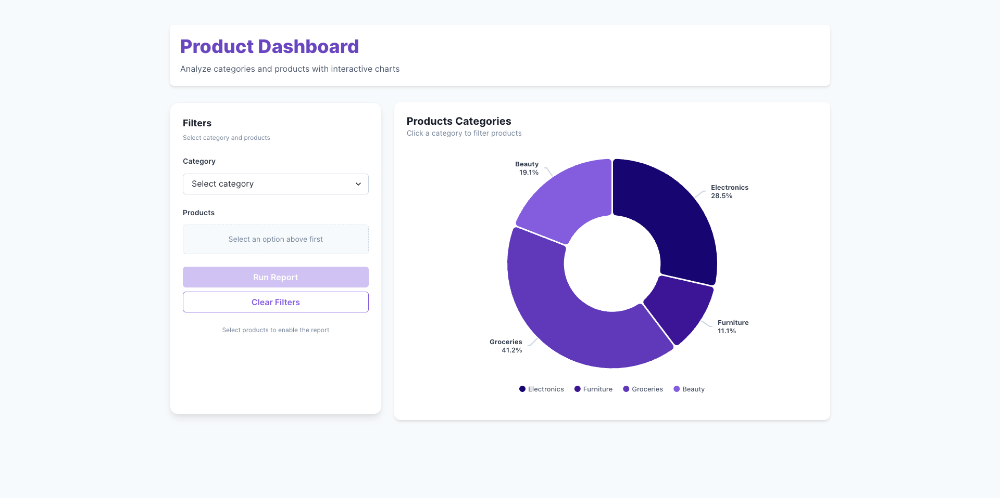

# 🚀 Product Category Dashboard

A modern micro-frontend dashboard application for visualizing and managing product categories with interactive charts and real-time data visualization.

## 📋 Overview

The Product Category Dashboard is built using a micro-frontend architecture, allowing for independent development and deployment of its components. The application consists of a container app (host) and a chart app (remote), communicating through Module Federation.

## ✨ Features

### Core Features

- **Micro-Frontend Architecture**
  - Independent deployment of chart components
  - Lazy loading for optimized performance
  - Isolated development environments

- **Interactive Data Visualization**
  - Dynamic bar, line, and pie charts
  - Real-time data updates
  - Responsive design for all devices

- **Modern UI/UX**
  - Clean, intuitive interface
  - Dark/Light mode support
  - Accessible components

## 🛠️ Tech Stack

### Frontend

- **Frameworks**: React 18, TypeScript
- **State Management**: Redux, Redux-Saga
- **UI Components**: Chakra UI v3, Framer Motion
- **Data Visualization**: Recharts, Highcharts
- **Build Tool**: Vite
- **Module Federation**: Webpack 5

### Development Tools

- **Testing**: Jest, React Testing Library
- **Linting/Formatting**: ESLint, Prettier
- **Version Control**: Git with Husky pre-commit hooks

## 🚀 Quick Start

### Prerequisites

- Node.js (v18+)
- pnpm (recommended - install with `npm install -g pnpm`)

### Installation

1. **Clone the repository**:

   ```bash
   git clone [your-repository-url]
   cd product-category-dashboard
   ```

2. **Install dependencies**:

   ```bash
   # Install pnpm if you haven't already
   npm install -g pnpm

   # Install all dependencies
   pnpm install
   ```

3. **Make the startup script executable** (Linux/MacOS):
   ```bash
   chmod +x start.sh
   ```

### Running Locally

#### Option 1: Using the start script (Recommended)

```bash
# Run the start script (Linux/MacOS)
./start.sh

# Or if you don't have execute permissions:
bash start.sh
```

#### Option 2: Manual startup

If you prefer to run the applications manually:

1. **Start the development servers** (in separate terminals):

   ```bash
   # Terminal 1 - Start chart app (must start first)
   cd chart-app
   pnpm run build && pnpm run preview

   # Terminal 2 - Start container app
   cd ../container-app
   pnpm dev
   ```

2. **Access the applications**:
   - Container App: http://localhost:5000
   - Chart App (standalone): http://localhost:5001

## 📁 Project Structure

```
product-category-dashboard/
├── chart-app/                  # Chart micro-frontend
│   ├── src/
│   │   ├── components/         # Reusable chart components
│   │   │   ├── BarChart/       # Bar chart implementation
│   │   │   ├── LineChart/      # Line chart implementation
│   │   │   └── PieChart/       # Pie chart implementation
│   │   └── theme/              # Theme configuration
│   └── package.json            # Dependencies and scripts
│
├── container-app/              # Main container application
│   ├── public/                 # Static assets
│   ├── src/
│   │   ├── components/         # UI components
│   │   ├── hooks/              # Custom React hooks
│   │   ├── store/              # Redux store
│   │   └── theme/              # Theme configuration
│   └── package.json            # Dependencies and scripts
│
├── .husky/                     # Git hooks
└── package.json                # Root package.json
```

## 🔧 Environment Variables

Create a `.env` file in the root directory:

```env
# Container App
VITE_API_BASE_URL=http://localhost:3000/api
VITE_ENV=development

# Chart App
VITE_CHART_API_ENDPOINT=/api/chart-data
```

## 🧪 Testing

Run tests for the project:

```bash
# Run all tests
pnpm test

# Run tests in watch mode
pnpm test -- --watch

# Generate coverage report
pnpm test -- --coverage
```

## 🚀 Deployment

### Building for Production

```bash
# Build all applications
pnpm build:all

# The production build will be available in:
# - container-app/dist
# - chart-app/dist
```

### Deployment Options

1. **Static Hosting** (e.g., Vercel, Netlify)
   - Deploy the `container-app/dist` directory
   - Set up environment variables in your hosting platform

2. **Docker** (Example)

   ```dockerfile
   # Example Dockerfile for container-app
   FROM node:18-alpine
   WORKDIR /app

   # Install pnpm
   RUN npm install -g pnpm

   # Copy package files
   COPY package.json pnpm-lock.yaml ./

   # Install dependencies
   RUN pnpm install --frozen-lockfile

   # Copy source code
   COPY . .

   # Build the application
   RUN pnpm build

   # Start the application
   CMD ["pnpm", "preview"]
   ```

## 📅 Roadmap

### Technical Improvements

- [ ] Add end-to-end testing
- [ ] Implement CI/CD pipeline
- [ ] Add performance monitoring
- [ ] Improve bundle size optimization

## 📸 Screenshots


_Dashboard overview with interactive charts_
